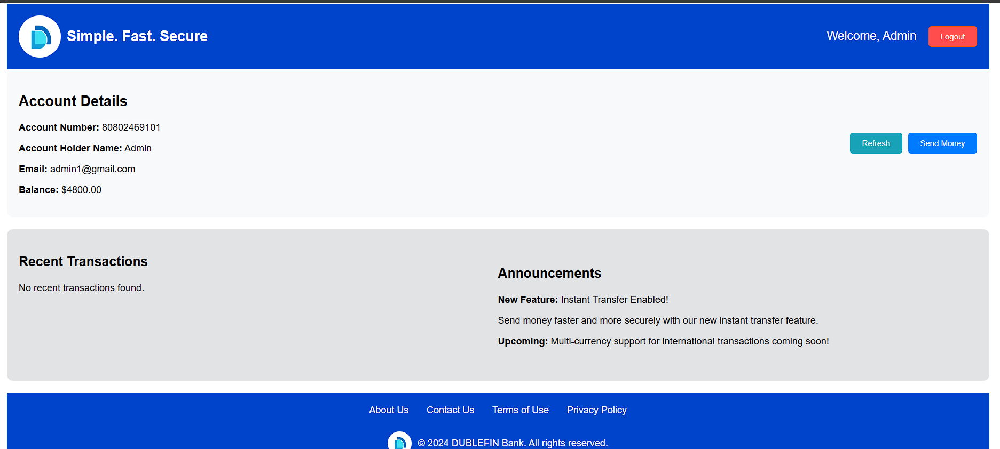
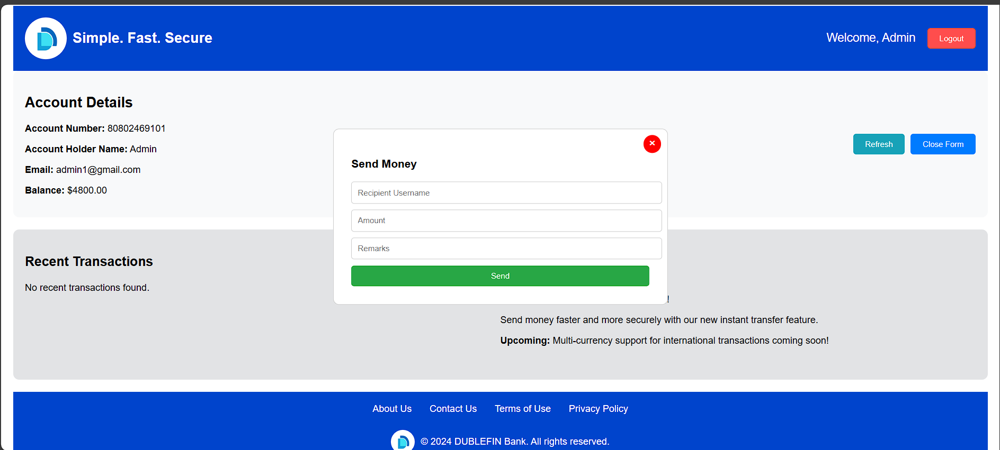

# Dublefin Banking Application

Overview:
Dublefin is a banking application designed to manage user accounts, track transactions, and provide seamless user experiences for handling their finances. This application is built using Node.js, Express, Sequelize, and MySQL to handle all backend processes, while integrating secure user authentication and transaction management features.

Screenshots:
Login

Register

Dashboard

Send Money form

Features:
User Registration and Authentication: Users can register and log in securely using JWT tokens.
Account Management: Users can view their account details, balance, and transaction history.
Transaction Handling: Send and receive money between users with transaction types (credit/debit).
Transaction History: View a detailed history of all transactions made by the user.
Security: JWT-based authentication for secure access to the API.

Tech Stack:
Node.js - Backend runtime environment.
Express.js - Web framework for building the API.
Sequelize ORM - Database ORM for interacting with MySQL.
MySQL - Relational database for storing user and transaction data.
Axios - Client-side library for making HTTP requests.
JWT Authentication - Used for secure API access.